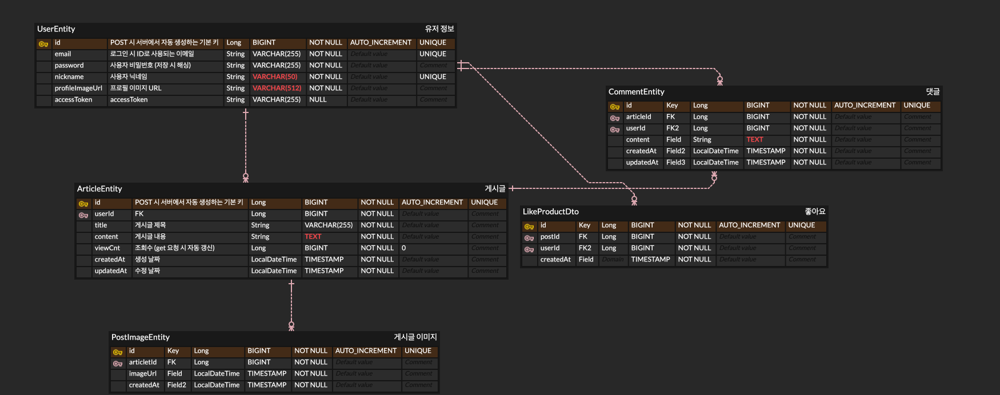

# Sound Space Backend

> 노래 추천 및 플레이리스트 공유 커뮤니티 사운드 스페이스의 백엔드 API 레포지토리입니다.

---

## 프로젝트 개요

- **프로젝트 목적**
  - 하루의 노래 추천 및 음악 플레이리스트 공유 커뮤니티
- **주요 기능**
  - 회원 가입 / 로그인 (JWT 기반 인증)
  - 게시글 작성, 조회, 수정, 삭제 (CRUD)
  - 댓글 작성 및 관리
  - 게시글 좋아요 기능
  - 인피니티 스크롤링 (페이지네이션)

---

## 기술 스택

### Backend

- **Language**: Java 17
- **Framework**: Spring Boot 3.5.6
- **Build Tool**: Gradle
- **ORM**: Spring Data JPA (Hibernate)
- **Security**: Spring Security + JWT

### Database

- **DB**: MySQL 8.4.0
- **SQL Logging**: P6Spy

### Library

- **JWT**: io.jsonwebtoken (JJWT) 0.12.3
- **Validation**: Spring Boot Validation
- **API Documentation**: SpringDoc OpenAPI (Swagger) 2.8.0
- **Lombok**: 1.18.42

---

## ERD 설계

ERD Cloud:  


### 주요 엔티티

#### UserEntity

- 사용자 계정 정보 관리
- email, password(해싱), nickname, profileImageUrl
- Article과 1:N 관계
- RefreshToken과 1:1 관계

#### ArticleEntity

- 게시글 정보 관리
- title, contents, viewCnt, createdAt, updatedAt
- User와 N:1 관계 (ManyToOne, LAZY)
- ArticleImage와 1:N 관계 (양방향)
- Comment, Like와 1:N 관계 (단방향)

#### CommentEntity

- 댓글 정보 관리
- contents, createdAt, updatedAt
- Article, User와 N:1 관계 (ManyToOne, LAZY)

#### LikeArticleEntity

- 게시글 좋아요 정보 관리
- Article, User와 N:1 관계 (ManyToOne, LAZY)

#### RefreshTokenEntity

- JWT Refresh Token 관리
- tokenHash, revoked (soft delete), expiresAt
- User와 1:1 관계
- 로그아웃 시 revoked = true로 설정

---

## 프로젝트 구조

### 도메인 중심 패키지 구조 (Domain-Driven Package Structure)

```
src/main/java/com/example/anyword/
├── Article/              # 게시글 도메인
│   ├── controller/      # ArticleController
│   ├── service/         # ArticleService
│   ├── repository/      # ArticleRepository, ArticleImageRepository
│   ├── entity/          # ArticleEntity, ArticleImageEntity
│   ├── dto/             # Request/Response DTO
│   └── mapper/          # Entity-DTO 매퍼
│
├── User/                # 사용자 도메인
│   ├── controller/
│   ├── service/
│   ├── repository/
│   ├── entity/
│   ├── dto/
│   └── mapper/
│
├── Comment/             # 댓글 도메인
│   ├── controller/
│   ├── service/
│   ├── repository/
│   ├── entity/
│   ├── dto/
│   └── mapper/
│
├── LikeArticle/         # 좋아요 도메인
│   ├── controller/
│   ├── service/
│   ├── repository/
│   └── entity/
│
├── Auth/                # 인증 도메인
│   ├── controller/      # AuthController (토큰 재발급)
│   ├── service/         # AuthService
│   ├── repository/      # RefreshTokenRepository
│   └── entity/          # RefreshTokenEntity
│
├── security/            # Spring Security 설정
│   ├── config/          # WebSecurityConfig
│   ├── customFilter/    # JwtAuthFilter
│   ├── customUserDetails/        # CustomUserDetails
│   ├── customUserDetailsService/ # CustomUserDetailsService
│   └── JWTUtil.java     # JWT 생성/검증 유틸
│
├── shared/              # 공통 모듈
│   ├── constants/       # 상수 정의
│   ├── dto/             # 공통 Response DTO
│   ├── exception/       # 예외 처리 (GlobalExceptionHandler)
│   └── utils/           # 유틸리티 클래스
│
├── aop/                 # AOP (AuthAspect)
└── config/              # 애플리케이션 설정
```

### 설계 의도

- **도메인별 응집도 향상**: 레이어 중심에서 도메인 중심으로 변경하여 관련 코드를 한곳에 모음
- **변경 용이성**: 특정 도메인 수정 시 해당 폴더만 탐색하면 됨
- **비즈니스 로직 명확화**: 도메인별 경계가 명확하여 비즈니스 로직 파악 용이

---

## Spring Security 인증/인가 구현

### 인증 방식: JWT (JSON Web Token)

#### JWT 토큰 구조

- **Access Token**: 짧은 만료 시간, API 요청 시 사용
- **Refresh Token**: 긴 만료 시간, Access Token 재발급 시 사용, DB 저장

#### JWT 구현 상세

**1. JWTUtil (토큰 생성 및 검증)**

```java
// JWT 생성
- createAccessToken(email): Access Token 생성
- createRefreshToken(email): Refresh Token 생성
- Claims 기반 Payload 구성 (subject: email, issuedAt, expiration)
- HMAC-SHA 알고리즘으로 서명

// JWT 검증
- validateToken(token): 토큰 유효성 검증 (만료 여부 확인)
- getEmail(token): 토큰에서 이메일 추출
- parseClaims(token): 토큰 파싱
```

**2. JwtAuthFilter (인증 필터)**

- `OncePerRequestFilter` 상속
- `UsernamePasswordAuthenticationFilter` 이전에 실행
- Authorization 헤더에서 Bearer Token 추출
- 토큰 검증 후 `SecurityContextHolder`에 인증 정보 저장
- `/api/user/login`, `/api/user/signup` 경로는 인증 제외

**3. CustomUserDetailsService**

- `UserDetailsService` 구현
- email을 username으로 사용
- DB에서 사용자 조회 후 `CustomUserDetails` 반환

**4. CustomUserDetails**

- `UserDetails` 구현
- `UserEntity`를 포함하여 컨트롤러에서 직접 접근 가능
- DB 재조회 없이 사용자 정보 활용 (성능 최적화)

**5. RefreshToken 관리**

- DB에 저장하여 강제 로그아웃 및 토큰 무효화 구현
- `revoked` 필드로 soft delete
- 1인당 1세션 정책 (OneToOne 관계)
- 재로그인 시 기존 토큰 덮어쓰기

#### 인증 흐름

```
1. 로그인 (POST /api/user/login)
   → 이메일/비밀번호 검증
   → Access Token 생성 (응답 Body)
   → Refresh Token 생성 (Cookie에 저장)
   → Refresh Token을 DB에 저장

2. API 요청
   → JwtAuthFilter에서 Access Token 검증
   → 유효한 경우 SecurityContext에 인증 정보 설정
   → Controller에서 @AuthenticationPrincipal로 사용자 정보 접근

3. Access Token 만료 시 재발급 (POST /api/auth/refresh)
   → Refresh Token 검증
   → DB에서 revoked 여부 확인
   → 새로운 Access Token 발급

4. 로그아웃
   → Refresh Token의 revoked를 true로 설정
   → 해당 Refresh Token 사용 불가
```

### 인가 방식: Spring Security FilterChain

**WebSecurityConfig 설정**

```java
// CORS 설정
- Filter 레벨에서 CORS 처리 (인증 필터보다 앞단)
- Preflight 요청(OPTIONS) 처리
- 인증 실패 시에도 CORS 에러가 다른 에러를 가리지 않도록 설정

// Session 정책
- SessionCreationPolicy.STATELESS (JWT 사용으로 세션 미사용)

// 인가 규칙
- /api/user/login, /api/user/signup: 모두 접근 가능 (permitAll)
- 그 외 모든 요청: 인증 필요 (authenticated)
```

### 보안 고려사항

- Refresh Token을 HttpOnly Cookie로 전달 (XSS 방지)
- Access Token은 짧은 만료 시간 설정
- Refresh Token 탈취 대비 DB 저장 및 revoke 기능

---

## JPA 적용 및 최적화

### JPA 설계 원칙

#### 1. 연관관계 매핑 전략

- **ManyToOne 단방향**: Comment → Article, Like → Article
- **ManyToOne 양방향**: Article ↔ User
- **OneToMany 양방향**: Article ↔ ArticleImage
- **OneToOne**: User ↔ RefreshToken

#### 2. Fetch 전략

- **모든 연관관계를 LAZY Loading으로 설정**
- N+1 문제 방지를 위해 필요 시 JPQL의 `join fetch` 사용

#### 3. N+1 문제 해결

**문제 상황**

- 게시글 목록 조회 시 각 게시글마다 User, Like, Comment를 별도로 조회
- 1(게시글) + N(User) + N(Like) + N(Comment) = 총 3N+1번의 쿼리 발생

**해결 방법**

1. **Join Fetch 사용** (UserEntity)

```java
@Query("select a from ArticleEntity a join fetch a.author order by a.createdAt desc")
List<ArticleEntity> findAllByOrderByCreatedAtDesc(Pageable pageable);
```

2. **@BatchSize 사용** (ArticleImage)

```java
@OneToMany(mappedBy = "article")
@BatchSize(size=20)
private List<ArticleImageEntity> articleImageEntities;
```

3. **Bulk Query 작성** (Like, Comment 집계)

```java
// 여러 게시글의 좋아요 수를 한 번에 조회
@Query("select count(l) from LikeArticleEntity l where l.article.id in (:article_id) group by l.article.id")
List<Object[]> bulkCountByArticleId(@Param("article_id") List<Long> articleId);
```

#### 4. Query Method vs @Query

**Query Method 사용 사례**

- 단순 조회: `findByEmail`, `existsByNickname`
- Spring Data JPA가 메서드 이름 기반으로 쿼리 자동 생성

**@Query 사용 사례**

- 복잡한 조인: Join Fetch로 N+1 해결
- 집계 함수: GROUP BY, COUNT 등
- 성능 최적화가 필요한 쿼리

#### 5. Dirty Checking 활용

- `@Transactional` 안에서 영속 상태 엔티티 수정 시 자동 UPDATE
- 별도의 `save()` 호출 없이 변경 감지

**주의사항**

- `SecurityContextHolder`에서 가져온 `UserEntity`는 준영속 상태
- 수정 시 `save()` 호출 필요 또는 영속 상태 엔티티 재조회

---

## SOLID 원칙 적용

### 1. SRP (Single Responsibility Principle) - 단일 책임 원칙

**적용 사례**

- **도메인별 패키지 분리**: Article, User, Comment, LikeArticle, Auth 각 도메인이 고유 책임 보유
- **Layer 분리**: Controller(요청 처리), Service(비즈니스 로직), Repository(데이터 접근), Entity(데이터 모델)
- **JWTUtil**: JWT 생성 및 검증만 담당
- **CustomUserDetailsService**: 사용자 인증 정보 조회만 담당
- **GlobalExceptionHandler**: 예외 처리만 전담

### 2. OCP (Open-Closed Principle) - 개방-폐쇄 원칙

**적용 사례**

- **인터페이스 기반 설계**: Repository는 JpaRepository 인터페이스 확장
- **UserDetailsService 구현**: Spring Security의 인터페이스를 구현하여 확장
- **Exception 계층 구조**: `BusinessException`을 상속한 커스텀 예외들 (BadRequestException, NotFoundException 등)
- **Mapper 인터페이스**: Entity ↔ DTO 변환 로직을 인터페이스로 정의

**리팩토링 사례**

- InMemory Repository → JPQL Repository → Spring Data JPA Repository
- Primary 어노테이션으로 구현체 교체 가능 (코드 수정 최소화)

### 3. LSP (Liskov Substitution Principle) - 리스코프 치환 원칙

**적용 사례**

- **UserDetailsService 구현**: `CustomUserDetailsService`가 Spring Security의 `UserDetailsService` 인터페이스를 완전히 대체 가능
- **Filter 구현**: `JwtAuthFilter`가 `OncePerRequestFilter`를 상속하여 표준 Filter로 동작
- **Exception 계층**: 모든 커스텀 예외가 `BusinessException`을 상속하여 일관된 예외 처리

### 4. ISP (Interface Segregation Principle) - 인터페이스 분리 원칙

**적용 사례**

- **Mapper 인터페이스 분리**: ArticleMapper, UserMapper, CommentMapper 각각 독립적으로 정의
- **Repository 분리**: ArticleRepository, UserRepository, CommentRepository 등 도메인별 분리
- **DTO 세분화**: Request DTO와 Response DTO 분리, 도메인별 DTO 분리

### 5. DIP (Dependency Inversion Principle) - 의존성 역전 원칙

**적용 사례**

- **Service가 Repository 인터페이스에 의존**: 구현체가 아닌 JpaRepository 인터페이스에 의존
- **Filter가 UserDetailsService 인터페이스에 의존**: 구체적인 구현체가 아닌 추상화에 의존
- **Spring DI 활용**: `@RequiredArgsConstructor`로 생성자 주입, 느슨한 결합 유지

```java
// ArticleService는 ArticleRepository 인터페이스에 의존
@RequiredArgsConstructor
public class ArticleService {
    private final ArticleRepository articleRepository; // 인터페이스
}

// JwtAuthFilter는 UserDetailsService 인터페이스에 의존
@RequiredArgsConstructor
public class JwtAuthFilter extends OncePerRequestFilter {
    private final UserDetailsService userDetailsService; // 인터페이스
    private final JWTUtil jwtUtil;
}
```

### Entity 설계 원칙

**Setter 사용 지양**

- 모든 Entity에서 public setter 제거
- 의미 있는 메서드 사용: `returnUpdatedArticle()`, `incrementViews()`, `logout()` 등
- 불변성 보장 및 의도 명확화

**예시**

```java
// AS-IS (지양)
article.setTitle(newTitle);
article.setContent(newContent);

// TO-BE (권장)
article.returnUpdatedArticle(newTitle, newContent);
```

---

## 환경 변수 설정

`.env.properties` 파일을 생성하고 다음 값을 설정하세요.

```properties
SERVER_PORT=8080
DB_URL=jdbc:mysql://localhost:3306/your_database?useSSL=false&serverTimezone=Asia/Seoul
DB_USERNAME=your_username
DB_PASSWORD=your_password
JWT_SECRET_KEY=your_secret_key_at_least_256_bits_long
JWT_ACCESS_EXPIRATION=3600000
JWT_REFRESH_EXPIRATION=604800000
```

---

## API 문서

**Swagger UI**: [http://localhost:8080/swagger-ui/index.html](http://localhost:8080/swagger-ui/index.html)

### 주요 엔드포인트

#### 인증 (Auth)

- `POST /api/user/signup` - 회원가입
- `POST /api/user/login` - 로그인
- `POST /api/auth/refresh` - Access Token 재발급

#### 사용자 (User)

- `GET /api/user/current` - 현재 로그인 사용자 정보 조회
- `PUT /api/user/current` - 사용자 정보 수정
- `DELETE /api/user/current` - 회원 탈퇴

#### 게시글 (Article)

- `GET /api/articles?sort={latest|popular}&page={page}` - 게시글 목록 조회
- `GET /api/articles/{articleId}` - 게시글 상세 조회
- `POST /api/articles` - 게시글 작성
- `PUT /api/articles/{articleId}` - 게시글 수정
- `DELETE /api/articles/{articleId}` - 게시글 삭제

#### 댓글 (Comment)

- `GET /api/articles/{articleId}/comments` - 댓글 목록 조회
- `POST /api/articles/{articleId}/comments` - 댓글 작성
- `PUT /api/comments/{commentId}` - 댓글 수정
- `DELETE /api/comments/{commentId}` - 댓글 삭제

#### 좋아요 (Like)

- `POST /api/articles/{articleId}/like` - 좋아요 추가
- `DELETE /api/articles/{articleId}/like` - 좋아요 취소

---

## 실행 방법

1. MySQL 데이터베이스 생성
2. `.env.properties` 파일 설정
3. 애플리케이션 실행

```bash
./gradlew bootRun
```

---

## 회고 및 개선 사항

### 개발 회고

- **AOP에서 Filter로 전환**: 인증/인가를 Filter로 이동하여 SecurityContext 활용 및 DB 중복 조회 제거
- **도메인 중심 패키지 구조**: 응집도 향상, 도메인 변경 시 탐색 범위 최소화
- **N+1 문제 해결**: Join Fetch, @BatchSize, Bulk Query로 성능 최적화
- **Setter 제거**: 의미 있는 메서드로 대체하여 의도 명확화

### 향후 개선 계획

- Refresh Token 해싱 저장 (현재 평문 저장)
- CSRF 토큰 적용 검토
- 권한 세분화 (현재 ROLE_USER만 존재)
- Soft Delete 구현 확대
- 페이징 성능 개선 (Offset 방식 → Cursor 방식)
